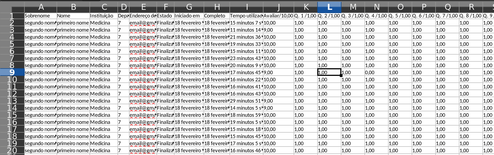
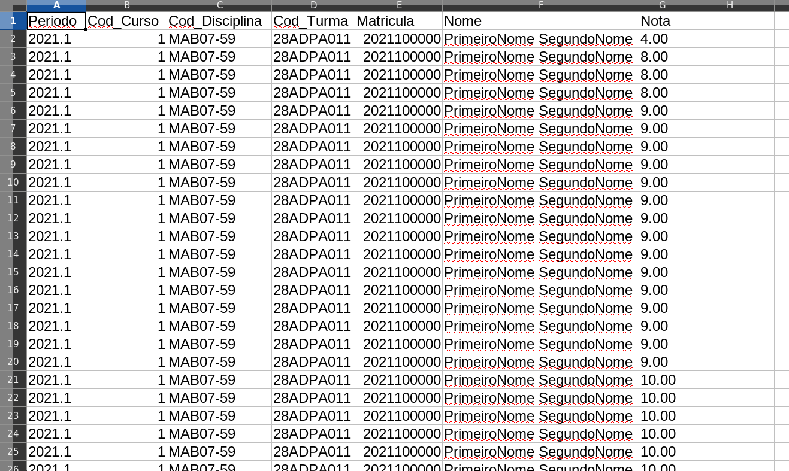
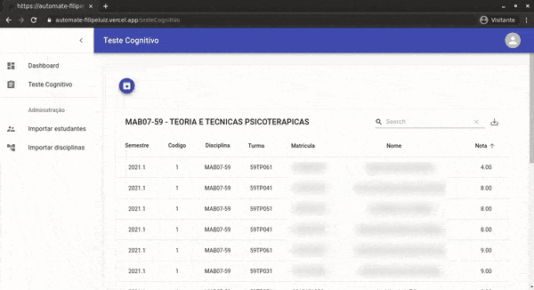

Automate

  
  

#

Este projeto me ajudou a automizar minhas tarefas quando eu trabalhava como Assistente Administrativo em uma faculdade. Ele me fez ter algum tempo livre para que eu pudesse fazer outras coisas. 
Trabalhei no Registro de Notas, organizava as planilhas e publicava as notas para os estudantes. As planilhas que o sistema da empresa fornecia, eram confusas e chegavam bastante desorganizadas. Perdia muito tempo organizando todos os dados das planilhas para que  ficassem iguais ao modelo padrão exigido pela faculdade. Eu perdia em média 12 min organizando uma planilha, imagina 10 planilhas ou mais? 
Eram aproximadamente 60 ~ 65 min para 10 planilhas serem prontas para a publicação. Meu projeto Automate conseguiu organizar uma planilha em apenas 5 segundos, ou seja: 
10 planilhas eram organizadas em 50 segundos, reduzi 99,86% de tempo, otimizando meu trabalho e me dedicando a outras tarefas. 

## Features

- NextJs
- ReactJs
- NodeJs
- Firebase

## Problema

A planilha desorganizada veio no sistema da empresa:

Necessidade de organizar a planilha do modelo padrão para consegue importar as notas no sistema, segue o modelo padrão(tipo .csv) abaixo:

## Uso

Automate resolveu esse problema com apenas 1 click

Para salvar a planilha que já veio modelo padrão

## License

[MIT License](./LICENSE)